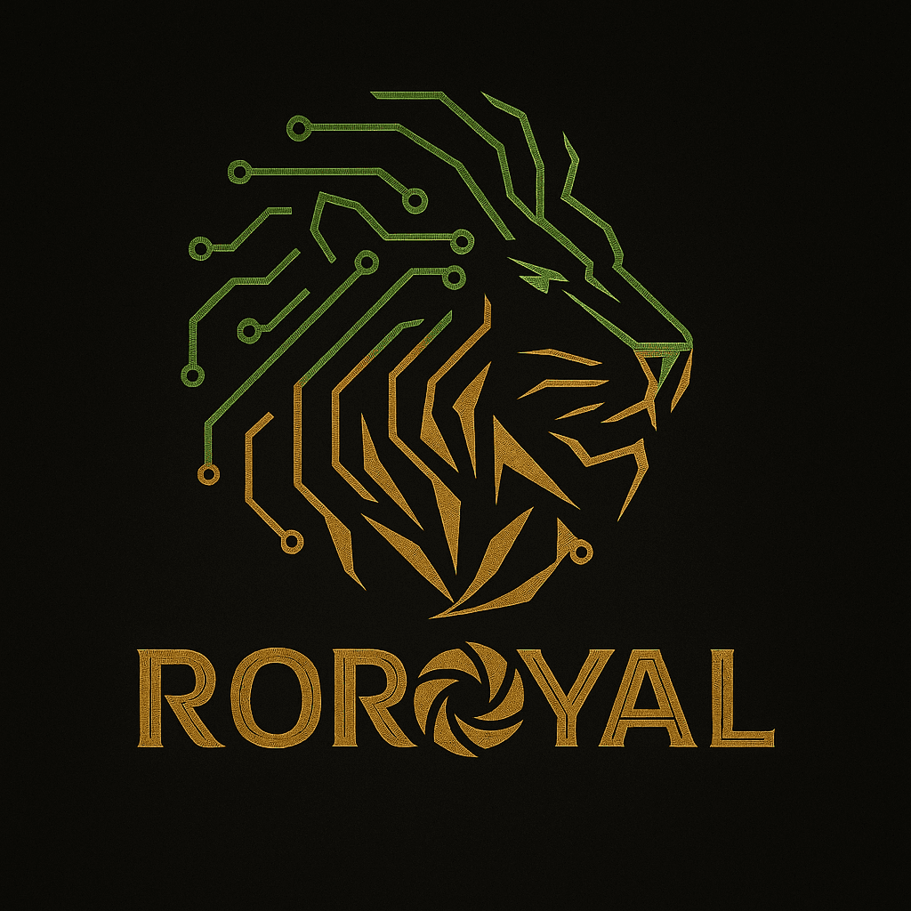
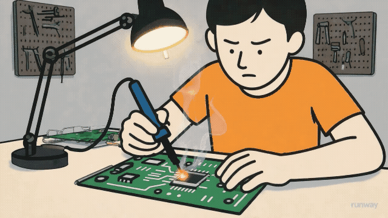

  

  

<h1 align="center">Hi, I'm Rohith DR</h1>

  
  
  

 

  
  

## 💫 About Me

  
  
  

    <h3>👨‍💻 Rohith DR | Electronics Engineer</h3>
    
Enthusiastic about designing advanced electronic solutions and ensuring smooth integration between hardware and software

    

    
🎯 Skills (Click to expand)

    

      
      🔧 Hardware Design
      - Circuit Design & Analysis
      - PCB Layout & Routing
      - Embedded Systems Development

      ⚡Electronics 
      - FPGA
      - Microcontrollers  
      - IoT Solutions 
      
      🔌Power Electronics
      - Power Supply Design
      - Motor Control
      - Energy Management
      
      💻 Programming
      - C/C++ for Embedded
      - Python for Automation
      - VHDL/Verilog
      
      🌐 Languages:
      - English
      - Hindi
      - Kannada
      
  

    

    "Engineering the future, one circuit at a time!"
  

## 🛠️ Skills & Expertise
  
### 🔌 Core Electronics

### 📡 Communication & Signal Processing

### ⚡ Power Electronics

### 💻 Programming

### 🛠️ Design Tools

### 🔧 Hardware Platforms

### 📊 Simulation & Analysis

## 🚀 Current Focus

- 🔭 Currently working on **Vlsi and Embedded system related projects**
- 🌱 Learning **Vlsi and Embedded systems**
- 👯 Looking to collaborate on **Electronics & Hardware Projects**
- 🤝 Open to **Innovative Engineering Solutions**
- 💬 Ask me about **Circuit Design, PCB Layout, Embedded Systems**
- 📫 Reach me at: **rohithrohith838@gmail.com**

## 🏆 Featured Projects

  <!-- Replace these with your actual repositories -->
  
  
  
  

## 📊 GitHub Stats

  
  

  

## 🏅 Achievements & Certifications

- 🎓 **ECE** - Global Academy of Technology
- 🏆 **Embedded System Design with ARM** - NPTEL
- 🏆 **Hardware Modeling Using Verilog** - NPTEL

## 🌐 Connect with Me

  
  

## 📈 Activity Graph

  

  <h2 style="color:#00FFFF;">🏆 GitHub Achievements 🏆</h2>
  
     

  <h2 style="color:#00FFFF;">📦 My GitHub Contributions</h2>
  
     

  <i>"If you want to find the secrets of the Universe, think in terms of energy, frequency and vibration." - NIKOLA TESLA </i>

  

---
